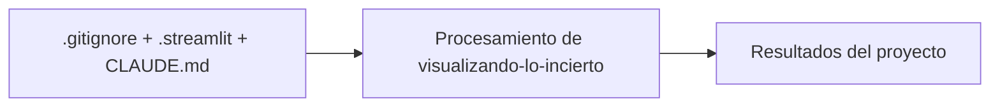

# Visualizando lo Incierto

## Descripción

**Semiótica y Cognición de la Probabilidad en la Era Algorítmica**

## Demo

La plataforma corre en Streamlit. El modo demo (`?mode=demo`) recorre el experimento completo sin registrar datos.

```bash
pip install -r requirements.txt
streamlit run streamlit_app.py
```

## Estructura

```
streamlit_app.py          # Plataforma del experimento (Streamlit)
data/questions.json       # 10 preguntas, ambas condiciones
src/diagrams/             # Generador de estímulos visuales (matplotlib)
src/data/                 # Captura y exportación de resultados
src/agents/               # Red de agentes IA para análisis cualitativo
analysis/                 # Análisis estadístico (t-test pareado)
assets/diagrams/          # Estímulos PNG (baseline y optimizado Gestalt)
docs/                     # Brief, protocolo, sistema de diseño, esquema de datos
```

## Documentación

| Documento | Contenido |
|---|---|
| [Lineamiento del proyecto](lineamiento_del_proyecto.md) | DTR: hipótesis, marco teórico, diseño experimental |
| [Product brief](docs/01_product_brief.md) | Objetivos, alcance MVP, roadmap |
| [Protocolo de investigación](docs/02_protocolo_investigacion.md) | Procedimiento, contrabalanceo, criterios de exclusión |
| [Sistema de diseño](docs/03_sistema_diseno.md) | Paleta accesible, leyes de Gestalt aplicadas |
| [Esquema de datos](docs/05_esquema_datos.md) | Modelo de datos y despliegue |

## Regenerar estímulos

```bash
python src/diagrams/generate_diagrams.py
```

Genera 20 PNG (10 preguntas × variante baseline/optimizada) desde `data/questions.json`.

## Licencia

Proyecto de investigación de Horacio Laphitz. Los datos de participantes son anónimos y se publican solo en forma agregada.

## Diagrama

[Explorar la arquitectura interactiva en GitDiagram](https://gitdiagram.com/HoracioLaphitz/visualizando-lo-incierto)



## Tecnologías

- Streamlit
