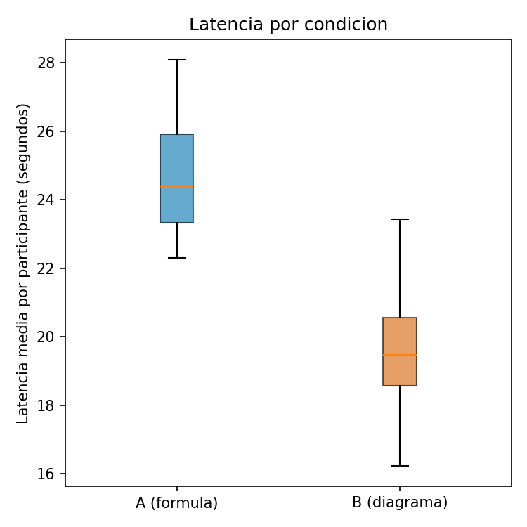
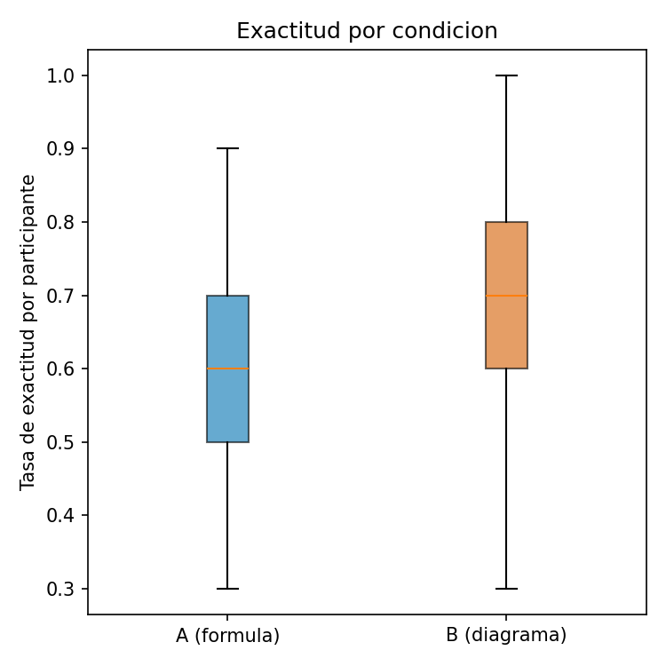
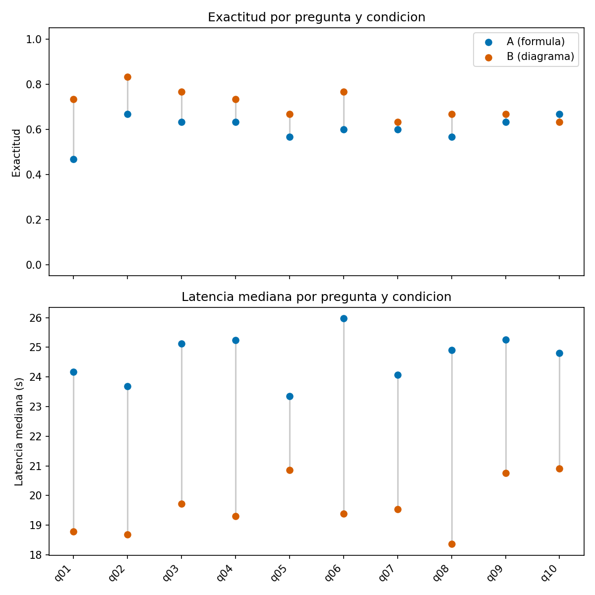

# DATOS SINTETICOS DE VALIDACION -- Reporte de Analisis

**ADVERTENCIA: este reporte fue generado con `analysis/generate_synthetic.py` sobre datos SINTETICOS, no con datos reales del experimento.** Su unico proposito es validar que el pipeline de analisis funciona de punta a punta y detecta un efecto plantado conocido (condicion B mas rapida y mas exacta que condicion A; ver `analysis/generate_synthetic.py` para los valores exactos).

Filas leidas: 600. Participantes con datos: 30. Participantes incluidos en el analisis pareado (ambas condiciones completas): 30.

**Regla de interpretacion:** se usa alfa = 0.05, dos colas, en todas las pruebas de hipotesis.

## Estadistica descriptiva (nivel participante, n = medias por condicion)

| Metrica | Condicion | n | Media | DE | Mediana |
|---|---|---|---|---|---|
| Latencia (s) | A (formula) | 30 | 24.577 | 1.515 | 24.401 |
| Latencia (s) | B (diagrama) | 30 | 19.494 | 1.559 | 19.476 |
| Exactitud | A (formula) | 30 | 0.603 | 0.140 | 0.600 |
| Exactitud | B (diagrama) | 30 | 0.710 | 0.154 | 0.700 |

## Prueba T pareada -- Latencia (H2: latencia_B < latencia_A)

- n = 30, t(29) = 11.899, p = 0.0000
- Diferencia media (A - B) = 5.084, DE de la diferencia = 2.340
- IC 95% de la diferencia: [4.210, 5.957]
- Cohen's d (pareado, dz) = 2.172
- Significativo a alfa=0.05: SI
- Shapiro-Wilk sobre diferencias: W = 0.960, p = 0.3022 (no se rechaza normalidad)

## Prueba T pareada -- Exactitud (H2: exactitud_B > exactitud_A)

- n = 30, t(29) = -2.761, p = 0.0099
- Diferencia media (A - B) = -0.107, DE de la diferencia = 0.212
- IC 95% de la diferencia: [-0.186, -0.028]
- Cohen's d (pareado, dz) = -0.504
- Significativo a alfa=0.05: SI
- Shapiro-Wilk sobre diferencias: W = 0.943, p = 0.1069 (no se rechaza normalidad)

## Chequeo de efecto de orden (validacion del contrabalanceo)

**diferencia de latencia (A - B)**: A-primero (n=15, media=4.471) vs B-primero (n=15, media=5.696) -- t = -1.462, p = 0.1552 (sin evidencia de efecto de orden).

**diferencia de exactitud (A - B)**: A-primero (n=15, media=-0.047) vs B-primero (n=15, media=-0.167) -- t = 1.594, p = 0.1223 (sin evidencia de efecto de orden).

## Desglose por pregunta (accion: identificar diagramas que ayudaron o perjudicaron)

| Pregunta | Exactitud A | Exactitud B | Diff (B-A) | Latencia mediana A (s) | Latencia mediana B (s) | Diff (B-A) |
|---|---|---|---|---|---|---|
| q01 | 0.467 | 0.733 | 0.267 | 24.166 | 18.777 | -5.388 |
| q02 | 0.667 | 0.833 | 0.167 | 23.681 | 18.684 | -4.996 |
| q03 | 0.633 | 0.767 | 0.133 | 25.120 | 19.726 | -5.395 |
| q04 | 0.633 | 0.733 | 0.100 | 25.239 | 19.306 | -5.932 |
| q05 | 0.567 | 0.667 | 0.100 | 23.346 | 20.855 | -2.491 |
| q06 | 0.600 | 0.767 | 0.167 | 25.973 | 19.386 | -6.587 |
| q07 | 0.600 | 0.633 | 0.033 | 24.078 | 19.543 | -4.536 |
| q08 | 0.567 | 0.667 | 0.100 | 24.908 | 18.361 | -6.547 |
| q09 | 0.633 | 0.667 | 0.033 | 25.266 | 20.754 | -4.512 |
| q10 | 0.667 | 0.633 | -0.033 | 24.803 | 20.907 | -3.896 |

## Figuras

- Latencia por condicion (boxplot): `boxplot_latencia.png`
  
- Exactitud por condicion (boxplot): `boxplot_exactitud.png`
  
- Desglose por pregunta (dot plot): `dotplot_por_pregunta.png`
  

## Notas de interpretacion

- El t-test pareado se calcula sobre agregados a nivel participante (media de latencia y tasa de exactitud por condicion), no sobre filas individuales de ensayo, porque los ensayos de un mismo participante no son observaciones independientes.
- Si Shapiro-Wilk sobre las diferencias arroja p < 0.05, se reporta ademas Wilcoxon como prueba de robustez no parametrica; si ambas coinciden en direccion y significancia, la conclusion es mas solida.
- El chequeo de efecto de orden compara, entre el grupo A-primero y B-primero, la diferencia intra-sujeto (A - B). Si no hay diferencia significativa entre grupos, el contrabalanceo neutralizo el efecto de orden/aprendizaje como se esperaba.
