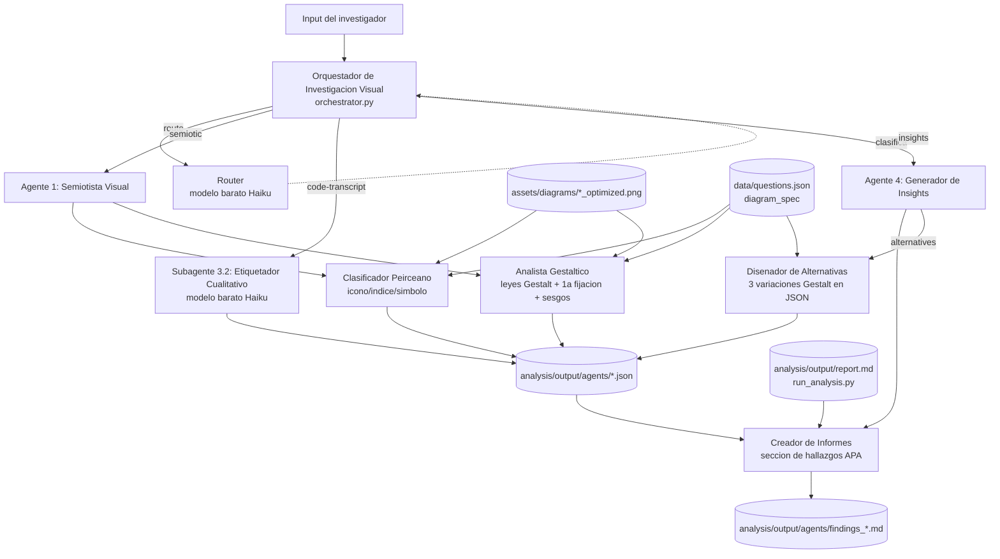

# 07 — Arquitectura de la Red de Agentes de IA

**Autor:** AI Architect
**Fuente de verdad:** `lineamiento_del_proyecto.md` (DTR v1.0), sección 9.
**Paquete:** `src/agents/`
**Salidas:** `analysis/output/agents/` (JSON y Markdown, con timestamp UTC).

Este documento describe la implementación ejecutable de la red de agentes de la
sección 9 del DTR. La red automatiza tres tareas del pipeline de investigación:
(1) deconstrucción semiótica de los diagramas, (2) codificación cualitativa de
transcripciones de "pensar en voz alta" (dato futuro), y (3) síntesis de
hallazgos. Es **post-MVP** (ver `docs/01_product_brief.md` §4): no bloquea la
recolección de los primeros 30 datos, pero se arquitectura ahora.

> Alcance implementado: Agente Maestro (Orquestador + Router), Agente 1
> (Semiotista Visual), Subagente 3.2 (Etiquetador Cualitativo) y Agente 4
> (Generador de Insights). El Agente 2 (Diseñador Experimental) y el Subagente
> 3.1 (Estadístico Inferencial) **ya existen** fuera de esta red como código
> determinista: `src/diagrams/generate_diagrams.py` y `analysis/run_analysis.py`
> respectivamente. No se reimplementan como agentes LLM porque son cálculo
> exacto, no interpretación.

---

## 1. Diagrama de la arquitectura



---

## 2. Flujo de datos

| Entrada | Producida por | Consumida por | Salida |
|---|---|---|---|
| `assets/diagrams/{id}_optimized.png` | `src/diagrams/generate_diagrams.py` | Clasificador Peirceano, Analista Gestáltico | — |
| `data/questions.json` (`diagram_spec`) | Banco de preguntas (UX Researcher) | Semiotista Visual, Diseñador de Alternativas | — |
| Transcripción `.txt` (pensar en voz alta) | Experimento (futuro) | Etiquetador Cualitativo | `transcript_coding_*.json` |
| `analysis/output/report.md` | `analysis/run_analysis.py` (Subagente 3.1) | Creador de Informes | — |
| Artefactos semióticos `*_semiotic_*.json` | Semiotista Visual | Creador de Informes | — |
| Artefactos de codificación `transcript_coding_*.json` | Etiquetador Cualitativo | Creador de Informes | — |

El **Creador de Informes** es el punto de convergencia: cruza teoría (Agente 1),
estadística (Agente 3 vía `report.md`) y cualitativo (Subagente 3.2) para redactar
la sección de hallazgos, como pide el DTR (Subagente 4.1).

---

## 3. Mapeo DTR sección 9 → módulos

| DTR §9 | Rol | Módulo / clase |
|---|---|---|
| Agente Maestro "Orquestador" | Distribuye tareas, guarda salidas | `orchestrator.py` (`main`, `cmd_*`) |
| Subagente 1.1 "Router" | Clasifica el input y enruta | `orchestrator.Router` (modelo barato) |
| Agente 1 "Semiotista Visual" | Deconstrucción de la imagen | `semiotist.py` |
| Subagente 1.1 "Clasificador Peirceano" | Etiqueta ícono/índice/símbolo | `semiotist.PeirceanClassifier` |
| Subagente 1.2 "Analista Gestáltico" | Leyes Gestalt, 1ª fijación, sesgos | `semiotist.GestaltAnalyst` |
| Subagente 3.2 "Etiquetador Cualitativo" | Codifica transcripciones | `qualitative_coder.QualitativeCoder` |
| Agente 4 "Generador de Insights" | Sintetiza hallazgos | `insight_generator.py` |
| Subagente 4.1 "Creador de Informes" | Redacta hallazgos académicos | `insight_generator.ReportWriter` |
| Subagente 4.2 "Diseñador de Alternativas" | Propone 3 rediseños Gestalt | `insight_generator.AlternativeDesigner` |
| (base común) | Cliente, reintentos, visión, JSON | `base.py` (`BaseAgent`, `get_client`) |

Agente 2 (Diseñador Experimental) y Subagente 3.1 (Estadístico Inferencial) se
cubren con código determinista existente (`generate_diagrams.py`,
`run_analysis.py`) y quedan fuera de esta red LLM a propósito: el DTR §4.3 exige
que el análisis nunca se separe de la exactitud matemática.

---

## 4. Elección de modelos y justificación de costo

Modelos vía `src/agents/base.py`, sobreescribibles globalmente con la variable
de entorno `ANTHROPIC_MODEL`.

| Agente | Modelo por defecto | Por qué |
|---|---|---|
| Clasificador Peirceano | `claude-sonnet-5` | Análisis semiótico + visión: requiere razonamiento sobre teoría de Peirce y lectura de imagen. Sonnet 5 da calidad casi-Opus a costo Sonnet. |
| Analista Gestáltico | `claude-sonnet-5` | Ídem: percepción visual + predicción de fijación ocular. |
| Creador de Informes | `claude-sonnet-5` | Redacción académica que integra tres fuentes sin contradecir la estadística. |
| Diseñador de Alternativas | `claude-sonnet-5` | Diseño fundamentado en Gestalt/Peirce, salida estructurada. |
| Etiquetador Cualitativo | `claude-haiku-4-5-20251001` | Clasificación de fragmentos: tarea de alto volumen y baja complejidad → el modelo barato es suficiente. |
| Router | `claude-haiku-4-5-20251001` | Clasificar una petición en un pipeline es trivial; no justifica un modelo caro. |

**Racional de costo:** los agentes de análisis (visión + razonamiento) usan
Sonnet; las tareas de enrutamiento y etiquetado —las de mayor volumen previsto en
producción (n=30 participantes × muchos fragmentos de transcripción)— usan Haiku,
más barato y rápido. La clave API sale de `ANTHROPIC_API_KEY` (nunca hardcodeada).

**Guarda de costo:** correr el análisis semiótico sobre las 10 preguntas
(`semiotic --all`) imprime una previsión de tamaño de entrada (requests, imágenes,
caracteres/tokens aproximados) y pide confirmación antes de gastar tokens. El flag
`--yes` la omite para corridas no interactivas.

> Nota sobre `budget_tokens`/`thinking`: `base.py` no envía parámetros de
> `thinking` ni de sampling, de modo que las llamadas son válidas tanto para
> Sonnet 5 (thinking adaptativo por defecto) como para Haiku 4.5 (que no soporta
> `effort`/`thinking`). Esto evita errores 400 al cambiar de modelo con
> `ANTHROPIC_MODEL`.

---

## 5. Cómo correr cada pipeline

Todos los comandos se ejecutan desde la raíz del repositorio. Requieren
`ANTHROPIC_API_KEY` en el entorno (ver §6). Cada paso es independiente.

```bash
# 1. Deconstrucción semiótica de UNA pregunta (Peirce + Gestalt sobre el PNG).
python -m src.agents.orchestrator semiotic --question q01

# 2. Deconstrucción semiótica de las 10 preguntas (con guarda de costo).
python -m src.agents.orchestrator semiotic --all          # pide confirmación
python -m src.agents.orchestrator semiotic --all --yes    # sin confirmación

# 3. Codificar una transcripción de "pensar en voz alta".
python -m src.agents.orchestrator code-transcript ruta/a/transcripcion.txt

# 4. Redactar la sección de hallazgos (integra semiótica + report.md + transcripciones).
python -m src.agents.orchestrator insights

# 5. Proponer 3 rediseños para un diagrama que generó confusión.
python -m src.agents.orchestrator alternatives --question q09
python -m src.agents.orchestrator alternatives --question q09 --evidence "latencia mediana 42s, exactitud 0.3"

# 6. Enrutar una petición libre (Router, modelo barato).
python -m src.agents.orchestrator route --input "clasificá semióticamente este árbol"

# Ayuda de cualquier subcomando:
python -m src.agents.orchestrator --help
python -m src.agents.orchestrator semiotic --help
```

**Salidas** (en `analysis/output/agents/`, con timestamp UTC determinista):

- `{qid}_semiotic_{ts}.json` — clasificación Peirceana + análisis Gestáltico.
- `transcript_coding_{stem}_{ts}.json` — lista de fragmentos codificados.
- `findings_{ts}.md` — sección de hallazgos en español.
- `{qid}_alternatives_{ts}.json` — 3 variaciones de diseño estructuradas.

`insights` consume automáticamente el artefacto semiótico más reciente por
pregunta, todas las codificaciones de transcripción presentes, y
`analysis/output/report.md` si existe.

---

## 6. Configuración de `ANTHROPIC_API_KEY`

La clave se lee **solo** de la variable de entorno `ANTHROPIC_API_KEY`; nunca se
guarda en el código. Si falta, los agentes fallan con un mensaje claro en español
antes de intentar cualquier llamada.

```bash
# Linux / macOS
export ANTHROPIC_API_KEY="sk-ant-..."

# Windows PowerShell
$env:ANTHROPIC_API_KEY = "sk-ant-..."

# Windows (Git Bash, como en este entorno)
export ANTHROPIC_API_KEY="sk-ant-..."
```

Override opcional de modelo (para sweeps de costo o fijar un snapshot):

```bash
export ANTHROPIC_MODEL="claude-opus-4-8"   # aplica a TODOS los agentes
```

Dependencias: `anthropic>=0.34` (ya en `requirements.txt`). Instalar con
`pip install -r requirements.txt`.

---

## 7. Notas de diseño

- **Contrato de salida estructurada:** todo lo que otro proceso vaya a consumir
  se guarda como JSON; el único artefacto en prosa es la sección de hallazgos
  (`findings_*.md`), pensada para lectura humana. Los prompts piden JSON estricto
  y `base.parse_json` tolera cercas de código Markdown.
- **Prompts en español, código en inglés:** los prompts analizan material en
  español y deben producir artefactos en español; el código, comentarios e
  identificadores están en inglés (convención del repo, ver `run_analysis.py`).
- **Reintentos:** `BaseAgent` reintenta con backoff exponencial ante rate limits
  (respetando `retry-after`), errores 5xx y fallos de conexión; los 4xx se
  propagan sin reintentar.
- **Idempotencia parcial:** cada corrida escribe un archivo nuevo con timestamp;
  no sobreescribe corridas anteriores, lo que preserva la trazabilidad iterativa
  del análisis. `insights` toma siempre el semiótico más reciente por pregunta.
